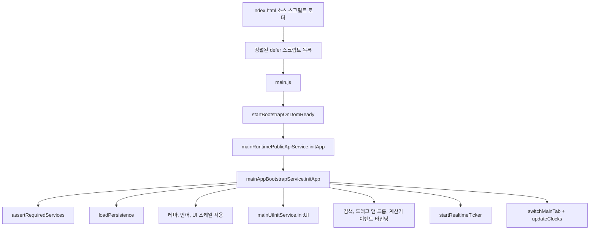
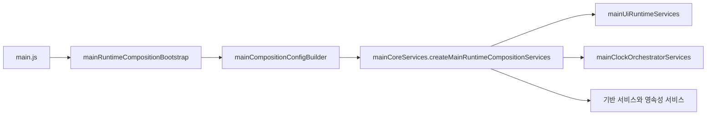
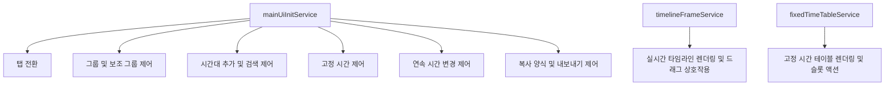

# Global Time Viewer 아키텍처

이 문서는 앱의 런타임 부트스트랩과 서비스 계층을 높은 수준에서 정리합니다. 리팩토링 중 깨지기 쉬운 경계를 빠르게 파악할 수 있도록 짧고 핵심적인 내용에 집중합니다.

## 부트스트랩 흐름

`main-app-bootstrap.js`는 런타임 코디네이터입니다. 비즈니스 규칙을 직접 소유하지 않고, 시작 순서를 조정하고, 타임아웃 가드를 적용하며, 실패 시 `showFatalError`를 통해 안전하게 종료합니다.

## 조립 계층

중요한 분리는 다음과 같습니다.

- `main.js`: 레거시 호환 셸이자 전역 바인딩 표면입니다.
- `mainRuntimeCompositionBootstrap`: 런타임 의존성을 하나의 조립 설정으로 묶습니다.
- `mainUiRuntimeServices`: `timelineFrameService`, `fixedTimeTableService`, `mainUiInitService` 같은 UI 지향 서비스를 생성합니다.
- `mainClockOrchestratorServices`: 주기적인 시계 및 타임라인 업데이트를 담당합니다.
- 기반 서비스와 영속성 서비스: 클립보드, 프롬프트, 토스트, 설정 입출력, 영속성 같은 브라우저 접점 기능을 감쌉니다.

## UI 런타임 책임

이 구분이 중요한 이유는 UI 부트스트랩과 렌더링이 동일한 책임이 아니기 때문입니다. `mainUiInitService`는 이벤트와 초기 제어 상태를 연결하고, 렌더링 비중이 큰 로직은 전문 서비스에 위임합니다.

## 상태와 도메인 경계

앱은 여전히 전역 스크립트 기반이지만, 새 코드 대부분은 모듈 간 직접 변이보다 서비스 경계를 따릅니다.

- 상태 accessor와 bridge는 모든 모듈이 전역 변수에 직접 의존하지 않도록 현재 앱 상태를 노출합니다.
- 도메인 서비스는 시간대, 고정 시간 슬롯, 영속성 스냅샷, 행 순서 같은 규칙을 소유합니다.
- facade와 bridge 모듈은 기존 `main.js` 경로가 새 서비스를 안전하게 호출할 수 있도록 호환 래퍼를 제공합니다.

동작을 수정할 때는 `main.js`에 분기를 더 추가하기보다, 해당 규칙을 소유한 가장 좁은 서비스부터 수정하는 편이 맞습니다.

## 빌드와 패키징 모델

- 소스 개발 모드는 여전히 전역 IIFE 모듈 순서를 사용하지만, `index.html`은 이제 소스 목록 관리를 `js/source-script-loader.js`에 위임합니다.
- `build_extension.ps1`은 확장 프로그램 패키지용 스크립트 자산을 concat/minify 합니다.
- `build:strict`는 버전 일관성을 검증하고 배포 가능한 `dist` 및 zip 산출물을 생성합니다.

즉, 패키지 결과물은 번들되더라도 소스 모드에서는 스크립트 순서가 여전히 런타임 계약입니다.

## 리팩토링 가드레일

- 시작 순서는 `main-app-bootstrap.js`에 유지합니다.
- 조립 배선은 bootstrap 및 config-builder 계층에 유지합니다.
- 가능하면 브라우저 API는 기반 서비스 뒤에 숨깁니다.
- 계층 간 로직 이동 전에는 범위가 좁은 모듈 테스트를 추가하거나 갱신합니다.
- `main.js`는 새 비즈니스 로직의 기본 위치가 아니라, 호환 셸로 취급합니다.
