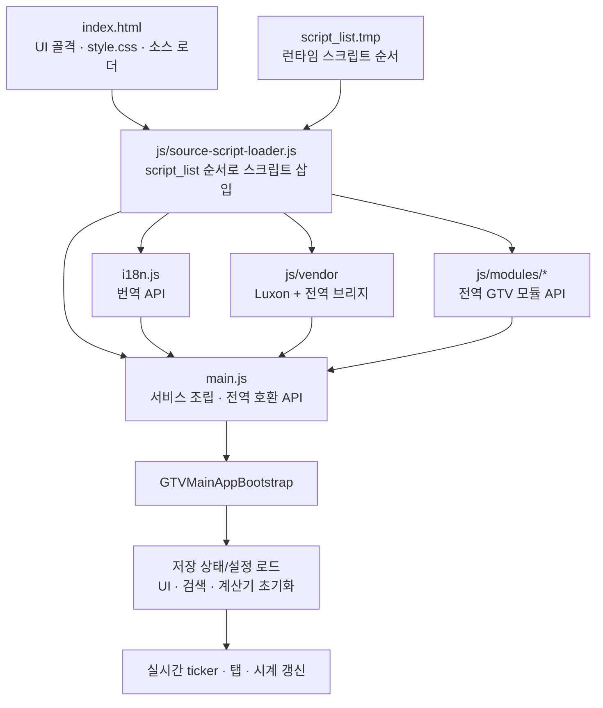
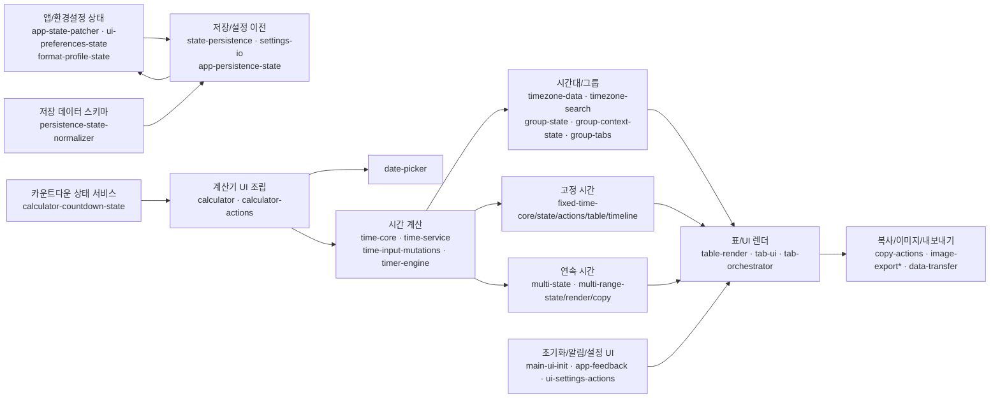

# Global Time Viewer 모듈 관계도

> 기준: v3.71.8 소스 트리. `script_list.tmp`, `main.js`, `js/modules/main-module-spec.js` 및 각 서비스의 `createService(deps)` 배선을 기준으로 정리했습니다. 파일 수는 소스 트리에서 계산한 값이며, 관계도는 모든 개별 의존성을 나열한 그래프가 아니라 런타임 레이어와 주요 연결을 보여줍니다.

모듈 파일별 전역 API, 입력 의존성 키, 반환 서비스 API, 모듈 등록 경로 및 `main.js` 조립 호출 목록은 [상세 인벤토리](module-dependency-inventory.md)를 참고하세요. 이 인벤토리는 [generate-module-dependency-inventory.mjs](../scripts/generate-module-dependency-inventory.mjs)로 현재 소스에서 다시 생성할 수 있습니다.

기능 변경 위치와 `main.js` 조립 단계를 빠르게 찾으려면 [코드 구조 탐색 안내](code-navigation.md)를 참고하세요.

## 런타임 진입 및 로딩

`index.html`은 생성된 소스 로더 하나를 포함합니다. 로더는 `script_list.tmp`의 런타임 스크립트를 `async = false`로 삽입해 선언 순서 실행을 요청합니다. `main.js`가 목록 끝에 있어 모듈 전역 API가 준비된 뒤 서비스 조립을 시작합니다. 확장 빌드는 같은 순서 목록을 하나의 축약 번들로 결합하고 Vite 산출물 및 확장 파일을 만듭니다.

## `main.js` 조립 계층

모듈은 ES `import`로 연결되지 않습니다. 각 파일이 `window`/`globalThis`에 `GTV...` API를 등록하고, `main.js`가 `main-module-spec.js`의 명세와 `main-module-resolver.js`를 통해 모듈을 확인한 뒤 `createService(deps)`에 의존성을 전달합니다.

```mermaid
flowchart LR
    SPEC["main-module-spec\n전역 이름 · 필수 API · 선택 모듈"] --> RESOLVE["main-module-resolver\nAPI 존재/형태 검사"]
    RESOLVE --> MAIN["main.js\n의존성 조립 · 전역 API 호환 셸"]
    STATE["상태/호스트 준비\nstate vars · host · primary state"] --> CORE["핵심 서비스 조립\ncore assembly · foundation · helpers"]
    MAIN --> SPEC
    MAIN --> STATE
    STATE --> CORE
    CORE --> DOMAIN["도메인 서비스\ntimezone · fixed time · multi-range\n시간 조정 · 그룹 · persistence"]
    DOMAIN --> UI["UI/렌더 서비스\ntable · timeline · tabs · image export"]
    CORE --> COMPOSE["composition bootstrap\n도메인 설정/서비스 조립"]
    DOMAIN --> COMPOSE
    UI --> COMPOSE
    COMPOSE --> WIRE["runtime bootstrap wiring"]
    WIRE --> PUBLIC["runtime public API bindings"]
    PUBLIC --> APP["main-app-bootstrap\n초기화 순서 실행"]
```

주요 조립 진입점은 다음과 같습니다.

| 단계 | 모듈 | 역할 |
| --- | --- | --- |
| 명세와 검사 | `main-module-spec.js`, `main-module-resolver.js`, `main-module-resolution-bindings.js` | 전역 API 이름, 필수 `createService`, 선택 모듈 및 데이터 형식 검증 |
| 기본 상태/호스트 | `main-state-initializer.js`, `main-runtime-host-utils.js`, `main-runtime-primary-state.js`, 관련 `*-bindings.js` | 브라우저 API와 앱 기본 상태를 안전한 서비스 의존성으로 제공 |
| 핵심/상태 조립 | `main-runtime-state-core-bootstrap.js`, `main-runtime-core-assembly-bootstrap.js`, `main-runtime-core-foundation-bootstrap.js`, `main-runtime-state-helper-bootstrap.js`, `main-runtime-core-service-bootstrap.js` | 상태 접근, 공통 서비스, 핵심 의존성 조립 |
| UI/도메인 서비스 조립 | `main-runtime-table-image-bootstrap.js`, `main-runtime-domain-service-bootstrap.js`, `main-runtime-ui-services-bootstrap.js`, `main-runtime-persistence-composition-bootstrap.js`, `main-runtime-composition-bootstrap.js` | 표/이미지, 도메인, 저장, 화면 관련 서비스를 구성 |
| 외부 연결 | `main-runtime-bootstrap-wiring.js`, `main-runtime-public-api-bindings.js`, `main-app-bootstrap.js` | UI·작업·부트스트랩 호출 연결, 앱 시작 순서 실행 |

`main.js`는 아직 이 조립 단계들을 직접 호출하고, 상태 변수를 클로저로 보유하며, 다수의 호환 전역 함수를 공개합니다. 따라서 현재의 주요 변경 위험 지점은 순수 기능 모듈보다는 이 파일의 배선과 전역 호환 경계입니다.

## 기능별 도메인 모듈

화살표는 대표적인 서비스 데이터 흐름입니다. 실제 구체 의존성은 `main.js`의 설정 객체와 각 조립 모듈을 통해 전달됩니다.

| 책임 | 관련 모듈 |
| --- | --- |
| 시간과 시간대 | `time-core.js`, `time-service.js`, `time-input-mutations.js`, `timezone-data.js`, `timezone-search.js`, `timer-engine.js` |
| 그룹 및 앱 상태 | `group-state.js`, `group-context-state.js`, `group-tabs.js`, `app-state-patcher.js`, `app-persistence-state.js`, `ui-preferences-state.js`, `format-profile-state.js` |
| 고정 시간 및 타임라인 | `fixed-time-core.js`, `fixed-time-slot-utils.js`, `fixed-time-state.js`, `fixed-time-actions.js`, `fixed-time-table.js`, `fixed-time-timeline.js`, `timeline-frame.js` |
| 연속 시간 편집 | `multi-state.js`, `multi-range-state.js`, `multi-range-render.js`, `multi-range-copy.js`, `multi-range-image-render.js`, `multi-bulk-tools.js` |
| 렌더·복사·이미지 | `table-render.js`, `table-image-render.js`, `copy-actions.js`, `image-export.js`, `image-export-actions.js`, `image-export-bridge.js`, `image-export-naming.js`, `image-clone.js`, `image-foreign-render.js` |
| 계산기·사용자 작업 | `calculator-countdown-state.js`(상태 정규화/표시), `calculator.js`(DOM 이벤트/기능 조립), `calculator-actions.js`, `date-picker.js`, `time-adjust-ui.js`, `time-adjust-actions.js`, `format-controls.js`, `ui-settings-actions.js` |
| 저장·설정 이동 | `persistence-state-normalizer.js`(저장 payload 정규화), `state-persistence.js`(저장소 동기화·로드·초기화), `persistence-service-bundle.js`, `settings-io.js`, `data-transfer.js` |

## 모듈 경계와 변경 시 확인 사항

- `js/modules/`에는 기능 모듈, `main-...-bindings`, accessor/proxy, bootstrap/config-builder 계열이 함께 있습니다. 이름이 유사해도 일부는 API 검증 또는 fallback 동작을 제공하므로 내용과 테스트를 확인하기 전에는 중복 모듈로 간주하지 않습니다.
- 공통 도메인 서비스는 대체로 `createService(deps)` 형태이고, 의존성을 명시적으로 전달합니다. 반면 `main.js`는 레거시 호환과 전역 상태 연결을 담당하므로 새 도메인 로직을 이 파일에 추가하기보다 기능 모듈에 두고 조립부에서 연결하는 것이 현재 패턴에 맞습니다.
- 새 런타임 모듈을 추가하거나 제거할 때는 `script_list.tmp`를 갱신한 뒤 `npm run sync:source-loader`를 실행합니다. 이 명령과 빌드는 목록 중복·경로·파일 누락·전체 런타임 파일 포함 여부를 검사합니다.
- 변경 확인은 영향 모듈 테스트, `npm run lint`, `npm run test:coverage`, 배포 전 `npm run build:strict` 순으로 수행합니다. 빠른 전체 확인은 `npm run ci:gate`입니다.

## 관계도의 한계

이 관계도는 현재 소스의 로더 순서와 조립 계층을 요약합니다. 모듈 간 모든 개별 메서드 호출이나 상태 읽기/쓰기 엣지를 자동 추출한 그래프는 아닙니다. 특히 `main.js`가 의존성 객체를 조립하므로 세부 관계를 변경할 때는 해당 `createService` 호출부와 모듈 테스트를 함께 추적해야 합니다.
